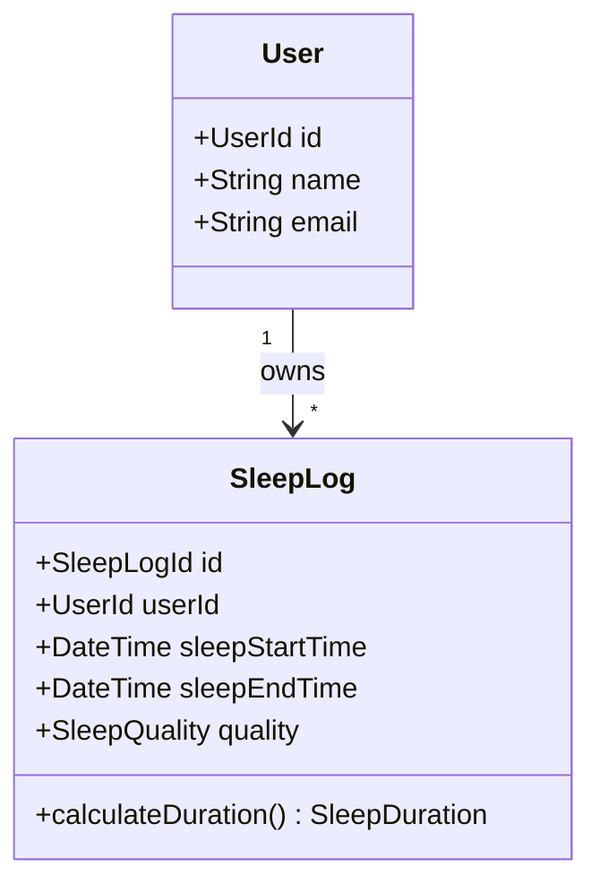

# ドメイン設計書 (Domain-design.md)

最終更新日: 2026/02/16

## 1. ドメイン概要

本システムは、ユーザーが日々の睡眠時間を記録・可視化することで、自身の睡眠習慣を客観的に把握し、改善に役立てるための睡眠管理プラットフォームである。

## 2. ユビキタス言語

| 用語                      | 定義                                                      | 備考           |
| ------------------------- | --------------------------------------------------------- | -------------- |
| ユーザー (User)           | 本システムを利用して睡眠を管理する主体。                  |                |
| 睡眠記録 (SleepLog)       | 1回の睡眠に関する記録。開始時刻、終了時刻、質などを含む。 | エンティティ   |
| 就寝時刻 (SleepStartTime) | ユーザーが実際に眠りについた時刻。                        |                |
| 起床時刻 (SleepEndTime)   | ユーザーが目覚めた時刻。                                  |                |
| 睡眠時間 (SleepDuration)  | 起床時刻 - 就寝時刻で計算される、実際の睡眠時間。         | 値オブジェクト |
| 睡眠の質 (SleepQuality)   | ユーザーが5段階等で自己評価した睡眠の深さや満足度。       | 値オブジェクト |

## 3. アグリゲート (Aggregate)

### User Aggregate

- **概要**: ユーザーの基本情報とアカウント状態を管理する。
- **Root Entity**: `User`
- **不変条件**:
  - メールアドレスは一意である必要がある。
  - ユーザー名は必須。

### SleepLog Aggregate

- **概要**: 個々の睡眠記録とその整合性を管理する。
- **Root Entity**: `SleepLog`
- **不変条件**:
  - `SleepStartTime` は `SleepEndTime` よりも前である必要がある。
  - 1人のユーザーに対して、同時刻に複数の睡眠記録が重なってはいけない（要検討）。
- **振る舞い**:
  - `updateQuality`: 睡眠の質を更新する。
  - `calculateDuration`: 就寝・起床時刻から睡眠時間を算出する。

## 4. 値オブジェクト (Value Object)

### SleepDuration

- **属性**: `minutes` (int)
- **ルール**: 負の値であってはならない。
- **メソッド**: `toHoursAndMinutes()`

### SleepQuality

- **属性**: `value` (int)
- **ルール**: 1から5の範囲内であること。

## 5. ドメインサービス (Domain Service)

### SleepAnalyticsService

- **概要**: 特定の期間（週間・月間）の睡眠データを集計・分析する。
- **メソッド**:
  - `calculateAverageDuration(UserId, Period)`: 指定期間の平均睡眠時間を計算する。
  - `identifyPatterns(UserId)`: 睡眠の傾向（夜更かし傾向など）を抽出する。

## 6. 仕様 (Specification)

### HealthySleepSpecification

- **目的**: 記録された睡眠が健康的（一般的な推奨時間内）かどうかを判定する。
- **判定基準**: 睡眠時間が 6時間以上 9時間以下 かつ 質が 3以上。

### OverlappingSleepLogSpecification

- **目的**: 新しい睡眠記録が既存の記録と時間的に重複していないか確認する。
