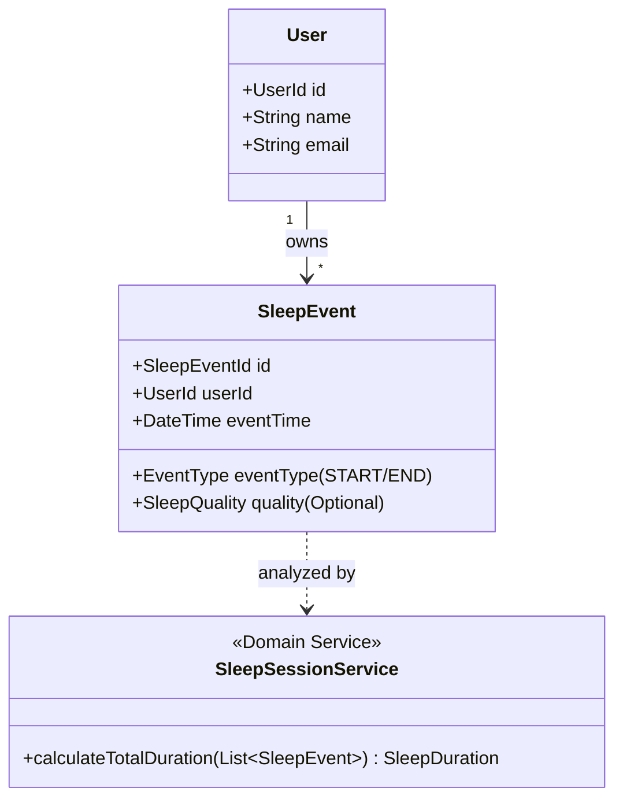

# ドメイン設計書 (Domain-design.md)

最終更新日: 2026/02/16

## 1. ドメイン概要

本システムは、ユーザーが日々の睡眠時間を記録・可視化することで、自身の睡眠習慣を客観的に把握し、改善に役立てるための睡眠管理プラットフォームである。

## 2. ユビキタス言語

| 用語                      | 定義                                                | 備考           |
| ------------------------- | --------------------------------------------------- | -------------- |
| ユーザー (User)           | 本システムを利用して睡眠を管理する主体。            |                |
| 睡眠イベント (SleepEvent) | 1回の睡眠に関する個々のイベント（就寝、起床など）。 | エンティティ   |
| 就寝イベント (SleepStart) | ユーザーが実際に眠りについたことを示すイベント。    |                |
| 起床イベント (SleepEnd)   | ユーザーが目覚めたことを示すイベント。              |                |
| 睡眠時間 (SleepDuration)  | 一連の睡眠イベントから計算される、実際の睡眠時間。  | 値オブジェクト |
| 睡眠の質 (SleepQuality)   | ユーザーが5段階等で自己評価した睡眠の深さや満足度。 | 値オブジェクト |

## 3. アグリゲート (Aggregate)

### User Aggregate

- **概要**: ユーザーの基本情報とアカウント状態を管理する。
- **Root Entity**: `User`
- **不変条件**:
  - メールアドレスは一意である必要がある。
  - ユーザー名は必須。

### SleepEvent Aggregate (Event Stream)

- **概要**: 個々の睡眠記録を「イベントの連続」として管理する。
- **Root Entity**: `SleepEvent`
- **振る舞いの抽出先**:
  - イベント自体は「点」であるため、複数のイベントから実際の意味あるセッション（睡眠）を組み立て、時間や質を計算する役割は **ドメインサービス (`SleepSessionService`)** に委譲する。

## 4. 値オブジェクト (Value Object)

### SleepDuration

- **属性**: `minutes` (int)
- **ルール**: 負の値であってはならない。
- **メソッド**: `toHoursAndMinutes()`

### SleepQuality

- **属性**: `value` (int)
- **ルール**: 1から5の範囲内であること。

## 5. ドメインサービス (Domain Service)

### SleepAnalyticsService

- **概要**: 特定の期間（週間・月間）の睡眠データを集計・分析する。
- **メソッド**:
  - `calculateAverageDuration(UserId, Period)`: 指定期間の平均睡眠時間を計算する。
  - `identifyPatterns(UserId)`: 睡眠の傾向（夜更かし傾向など）を抽出する。

## 6. 仕様 (Specification)

### HealthySleepSpecification

- **目的**: 記録された睡眠が健康的（一般的な推奨時間内）かどうかを判定する。
- **判定基準**: 睡眠時間が 6時間以上 9時間以下 かつ 質が 3以上。

### OverlappingSleepLogSpecification

- **目的**: 新しい睡眠記録が既存の記録と時間的に重複していないか確認する。
