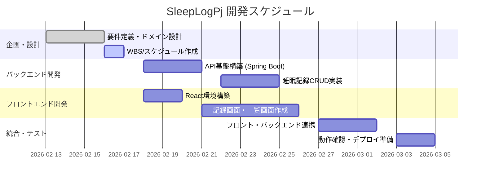

# WBS-Schedule.md

最終更新日: 2026/02/16

## スケジュール (Gantt Chart)

## WBS (Work Breakdown Structure)

### 1. プロジェクト管理

- [ ] プロジェクト定義 (`Project-doc.md`)
- [ ] 管理基盤構築 (`WBS-Schedule.md`)

### 2. バックエンド (Spring Boot)

- [ ] エンティティ実装 (User, SleepLog)
- [ ] リポジトリ層実装
- [ ] APIエンドポイント実装
  - [ ] POST /api/logs (登録)
  - [ ] GET /api/logs (一覧)
  - [ ] DELETE /api/logs/{id} (削除)

### 3. フロントエンド (React)

- [ ] プロジェクト初期化
- [ ] コンポーネント作成
  - [ ] 記録入力フォーム
  - [ ] 睡眠履歴リスト
- [ ] API連携実装 (Axios)

### 4. インフラ・共通

- [ ] Docker環境の最適化
- [ ] DBマイグレーション (Flyway/Liquibase等検討)
- [ ] バリデーションルールの適用
